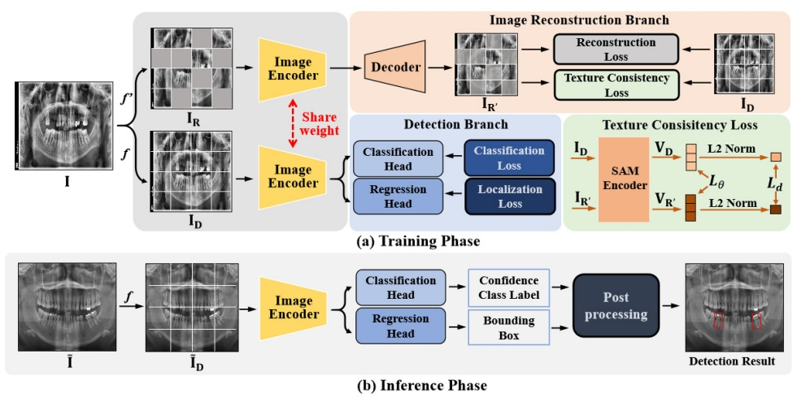

# SSAD：基于全景X光片的牙科疾病诊断自监督辅助检测框架

[English](README.md) | **中文**

[](https://arxiv.org/abs/2406.13963)
[](LICENSE)
[](https://www.python.org/downloads/release/python-380/)
[](https://pytorch.org/)

> 这是论文 [SSAD: Self-supervised Auxiliary Detection Framework for Panoramic X-ray based Dental Disease Diagnosis](https://arxiv.org/abs/2406.13963) 的官方实现代码。

## 📋 目录

- [概述](#概述)
- [框架结构](#框架结构)
- [环境要求](#环境要求)
- [安装指南](#安装指南)
- [数据准备](#数据准备)
- [训练](#训练)
- [评估](#评估)
- [模型库](#模型库)
- [引用](#引用)
- [许可证](#许可证)

## 🔍 概述

SSAD（Self-supervised Auxiliary Detection）是一个基于重建的自监督方法框架，旨在辅助深度学习模型进行牙科疾病诊断。该框架利用自监督学习技术提高了模型在全景X光片上的检测性能。

## 🏗️ 框架结构



该框架主要包含以下组件：
- **主检测网络**：负责牙科疾病的主要检测任务
- **自监督辅助头**：通过重建任务提供额外的监督信号
- **多模态融合**：支持CLIP、SAM等预训练模型的特征融合

## 🛠️ 环境要求

- Python 3.8+
- PyTorch 1.12+
- CUDA 11.3+ (推荐)
- Linux系统 (推荐)

## ⚙️ 安装指南

### 步骤1：环境构建

```bash
conda create -n ssad python=3.8 -y
conda activate ssad
```
### 步骤2：安装PyTorch

```bash
# 例如：
# CUDA 11.8
conda install pytorch==2.2.2 torchvision==0.17.2 torchaudio==2.2.2 pytorch-cuda=11.8 -c pytorch -c nvidia
# CUDA 12.1
conda install pytorch==2.2.2 torchvision==0.17.2 torchaudio==2.2.2 pytorch-cuda=12.1 -c pytorch -c nvidia
```

### 步骤3：安装其他依赖

```bash
pip install -r requirements.txt
```

### 步骤4：安装CLIP

```bash
cd models/CLIP && pip install .
```

### 步骤5：安装MultiScaleDeformableAttention

请参考 [DINO](https://github.com/IDEA-Research/DINO) 的指导安装MultiScaleDeformableAttention。

## 📊 数据准备

请参考 [DentexSegAndDet](https://github.com/xyzlancehe/DentexSegAndDet) 进行数据准备。

数据集应该按照以下结构组织：
```
datasets/
├── dentex/
│   ├── images/
│   ├── annotations/
│   └── ...
```

## 🚀 训练

### 使用Detectron2训练SSAD

#### YAML配置文件方式：

```bash
python train_diffdet.py \
    --num-gpus 1 \
    --config-file configs/diffdet/diffdet.dentex.swinbase.disease.yaml \
    OUTPUT_DIR "模型权重保存路径" \
    MODEL.WEIGHTS "checkpoints/swin_base_patch4_window7_224_22k.pth"
```

#### Python配置文件方式：

```bash
python train_lazyconfig_net.py \
    --num-gpus 1 \
    --config-file configs/faster_rcnn/faster_rcnn_vitB_vitdet.py \
    "train.output_dir='模型权重保存路径'" \
    "train.init_checkpoint='checkpoints/vitdet.pkl'"
```

### 使用YOLOv8训练

```bash
cd yolov8-ssad

# 运行基线模型
export DEFAULT_CFG_PATH=./hyp.baseline.yaml && python train.py

# 运行SSAD模型
export DEFAULT_CFG_PATH=./hyp.ssad.yaml && python train_ssad.py
```

## 📈 评估

评估脚本即将提供...

## 🏆 模型库

| 网络 | 编码器 | SSAD | 检查点 | AP50:95 |
|------|--------|------|--------|---------|
| DINO | Res50 | ❌ | - | 15.42 |
| DINO | Res50 | ✅ | - | **17.12** |
| YOLOv8-L | CSPDarknet | ❌ | - | 33.9 |
| YOLOv8-L | CSPDarknet | ✅ | - | **37.0** |
| Faster RCNN | ViTDet-B | ❌ | - | 28.93 |
| Faster RCNN | ViTDet-B | ✅ | - | **31.04** |
| FCOS | ViTDet-B | ❌ | - | 14.46 |
| FCOS | ViTDet-B | ✅ | - | **19.18** |
| DiffusionDet | Swin-B | ❌ | - | 10.25 |
| DiffusionDet | Swin-B | ✅ | - | **11.40** |
| HierarchicalDet | Swin-B | ❌ | - | 24.15 |
| HierarchicalDet | Swin-B | ✅ | - | **26.70** |

> 📝 **注意**：加粗的数字表示使用SSAD框架后的性能提升

## 📖 引用

如果您在研究中使用了这项工作，请引用我们的论文：

```bibtex
@article{ssad2024,
  title={SSAD: Self-supervised Auxiliary Detection Framework for Panoramic X-ray based Dental Disease Diagnosis},
  author={作者姓名},
  journal={arXiv preprint arXiv:2406.13963},
  year={2024}
}
```

## 📄 许可证

本项目基于 [MIT许可证](LICENSE) 开源。

## 🤝 贡献

欢迎提交Issues和Pull Requests！

## 📧 联系我们

如有任何问题，请通过以下方式联系我们：
- 📧 邮箱：[您的邮箱]
- 🐛 Issues：[GitHub Issues](https://github.com/您的用户名/SSAD/issues)

---

⭐ 如果这个项目对您有帮助，请给我们一个星标！
